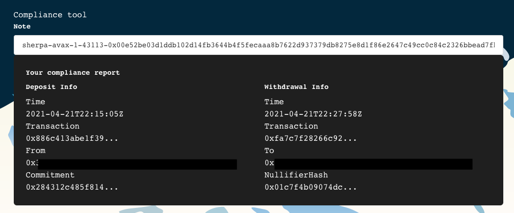

# Yasal Sorumluluk

Finansal gizlilik, finansal özgürlüğümüzü korumak için çok önemlidir. Fakat yasal sorumlulukların da es geçilmemesi gerekmektedir. Bu yüzden Sherpa Cash, kullanıcıları için bir yasal uyumluluk aracı hazırlamıştır.

## Yasal Uyumluluk Aracı

Bu araç, kullanıcılara yasal mevzuat veya vergi konularında gerekli uygunluğun karşılanmasını sağlamak için bir yol sunar:

Sherpa Cash üzerinde bir para yatırma işlemi yaptığınızda, sistem sizin için özel bir not oluşturur. Bu not, daha sonra fonlarınızı çekmenin yanı sıra, yatırılan fonun kaynağını göstermek için de kullanılabilir.

Dolayısıyla varlıklarınızın kaynağını göstermeniz gerekirse, Sherpa Cash'in oluşturduğu notu/notları kullanarak işlem geçmişinin kriptografik olarak doğrulanmış kanıtına ulaşabilirsiniz.

